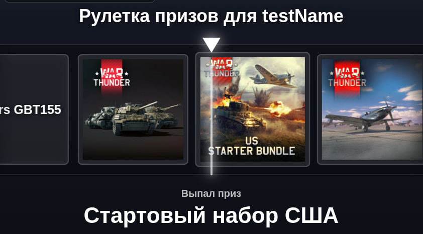

# OBS-Prize-Roulette

Рулетка с выпадением призов по War Thunder для OBS-оверлея. Оверлей
показывает анимированную ленту призов, выбирает победителя с учетом весов из
конфига и может запускаться автоматически по донатам DonationAlerts.

Звук рулетки: https://freesound.org/people/Squirrel_404/sounds/683048/

## Запуск

Запускайте рулетку через локальный Node-сервер.

### 1. Запустите сервер

```bash
node backend/server.js
```

Если все хорошо, в терминале появится такая строка:

```text
OBS Prize Roulette server: http://127.0.0.1:3000/
```

Терминал после этого не закрывайте. Пока он открыт, рулетка работает.

### 2. Откройте рулетку в браузере или OBS

В OBS добавьте источник `Браузер` / `Browser Source` и вставьте туда обычную
ссылку:

```text
http://127.0.0.1:3000/
```

Ссылка с debug-панелью, чтобы вручную проверить прокрутку без настоящего
доната:

```text
http://127.0.0.1:3000/?debug=1
```

### 3. DonationAlerts

Создать ID приложения можно [тут](https://www.donationalerts.com/application/clients).

Когда откроете страницу рулетки, она попросит ранее созданное ID приложения. Вставьте ID, нажмите кнопку авторизации и разрешите доступ.

Сделать тестовый донат можно [тут](https://www.donationalerts.com/dashboard/activity-feed/donations).
Нажмите кнопку "Добавить сообщение".

Пример работы рулетки:



## Настройка работы рулетки

### Общие настройки

Основные настройки лежат в `frontend/config.json`.

```jsonc
{
  "donationThreshold": 500,       // Сумма доната за одну прокрутку рулетки
  "spinDurationMs": 6000,         // Длительность вращения ленты
  "resultDisplayMs": 3000,        // Сколько показывать выпавший приз
  "closeDelayMs": 800,            // Задержка перед скрытием оверлея после результата
  "sound": "assets/test1234.mp3", // Звук смены карточки во время прокрутки
  "prizes": [                     // Список призов
    {
      "id": 1,
      "name": "150 золотых орлов", // Название приза; картинка ищется как uploads/<name>.png
      "weight": 0.636137866315001  // Вес приза (СУММА ВСЕХ ДОЛЖНА БЫТЬ === 1)
    }
  ]
}
```

### Изображения призов

Картинки лежат в `uploads` и должны быть в формате PNG. Имя файла должно
совпадать с `name` соответствующего приза:

```text
frontend/config.json: "name": "Wyvern"
uploads:     Wyvern.png
```

Перед запуском оверлей не сканирует папку `uploads` сам. Вместо этого он читает
готовый список файлов из `frontend/js/uploaded-images.js`. Этот файл генерируется
скриптом `generate-uploaded-images-manifest.js`.

Запуск скрипта:

```bash
node backend/scripts/generate-uploaded-images-manifest.js
```

Запускайте скрипт каждый раз после добавления, удаления или переименования PNG в
`uploads`. Иначе оверлей может не увидеть новую картинку и покажет текстовое
название приза.

## DonationAlerts

Настройки DonationAlerts находятся в блоке `donationAlerts` внутри
`frontend/config.json`.

```json
{
  "donationAlerts": {
    "applicationId": "",
    "proxyBaseUrl": "/api/donationalerts",
    "socketUrl": "wss://centrifugo.donationalerts.com/connection/websocket",
    "autoReconnect": true,
    "reconnectDelayMs": 5000
  }
}
```

Признак успешного подключения в консоли браузера:

```text
DonationAlerts channel subscribed: $alerts:donation_<userId>
```

## Структура проекта

```text
OBS-Prize-Roulette/
|-- frontend/                                 # Браузерная часть OBS-оверлея
|   |-- index.html                            # HTML-разметка оверлея и debug-панель
|   |-- style.css                             # Визуальное оформление рулетки
|   |-- script.js                             # Точка входа: инициализация, загрузка конфига, debug-панель, DonationAlerts
|   |-- config.json                           # Основной внешний конфиг призов, весов, таймингов, звуков и DonationAlerts
|   |-- js/
|   |   |-- config.js                         # Загрузка внешнего config.json и fallback-конфиг
|   |   |-- debug.js                          # Логика debug-панели и ручной симуляции доната
|   |   |-- donation-alerts.js                # DonationAlerts API/WebSocket и запуск рулетки по донату
|   |   |-- roulette.js                       # Выбор победителя, построение ленты, анимация и показ результата
|   |   |-- state.js                          # Общее состояние приложения
|   |   |-- uploaded-images.js                # Сгенерированный список доступных PNG-картинок из uploads
|   |   `-- utils.js                          # Общие утилиты для CSS-значений, звуков и расчетов
|   |-- assets/
|   |   `-- *.mp3                             # Звуки открытия, закрытия и результата
|   `-- tests/                                # Тесты браузерной логики
|-- backend/                                  # Node-сервер и серверные утилиты
|   |-- server.js                             # Локальный сервер, API-прокси DonationAlerts и раздача статики
|   |-- scripts/
|   |   `-- generate-uploaded-images-manifest.js
|   `-- tests/                                # Тесты сервера и backend-скриптов
|-- uploads/
|   `-- *.png                                 # Изображения призов; имя файла должно совпадать с name в config.json
`-- README.md
```
