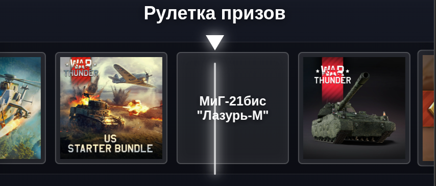

# OBS-Prize-Roulette

Рулетка с выпадением призов по War Thunder для OBS-оверлея. Оверлей
показывает анимированную ленту призов, выбирает победителя с учетом весов из
конфига и может запускаться автоматически по донатам DonationAlerts.

Звук рулетки: https://freesound.org/people/Squirrel_404/sounds/683048/

## Запуск

Для работы с внешним `config.json` и DonationAlerts запускайте проект через
локальный Node-сервер.

Если хотите переопределить host, port или адрес DonationAlerts API, создайте
локальный `.env` на основе примера:

```bash
cp .env.example .env
```

Затем запустите сервер:

```bash
node server.js
```

Пример обычной страницы:

```text
http://127.0.0.1:3000/
```

Пример страницы с debug-панелью для ручной симуляции доната:

```text
http://127.0.0.1:3000/?debug=1

или:

file:///home/lidline/Документы/test/OBS-Prize-Roulette/index.html?debug=1
```

Пример:



## Настройка

### Общие настройки

Основные настройки лежат в `config.json`.

```jsonc
{
  "donationThreshold": 500,       // Сумма доната за одну прокрутку рулетки
  "spinDurationMs": 6000,         // Длительность вращения ленты
  "resultDisplayMs": 3000,        // Сколько показывать выпавший приз
  "closeDelayMs": 800,            // Задержка перед скрытием оверлея после результата
  "sound": "assets/test1234.mp3", // Звук смены карточки во время прокрутки
  "prizes": [                     // Список призов
    {
      "id": 1,
      "name": "150 золотых орлов", // Название приза; картинка ищется как uploads/<name>.png
      "weight": 0.636137866315001  // Вес приза (сумма всех === 1)
    }
  ]
}
```

### Изображения призов

Картинки лежат в `uploads` и должны быть в формате PNG. Имя файла должно
совпадать с `name` соответствующего приза:

```text
config.json: "name": "Wyvern"
uploads:     Wyvern.png
```

Перед запуском оверлей не сканирует папку `uploads` сам. Вместо этого он читает
готовый список файлов из `js/uploaded-images.js`. Этот файл генерируется
скриптом `generate-uploaded-images-manifest.js`.

Запуск скрипта:

```bash
node scripts/generate-uploaded-images-manifest.js
```

Запускайте скрипт каждый раз после добавления, удаления или переименования PNG в
`uploads`. Иначе оверлей может не увидеть новую картинку и покажет текстовое
название приза.

## DonationAlerts

Настройки DonationAlerts находятся в блоке `donationAlerts` внутри
`config.json`.

```json
{
  "donationAlerts": {
    "applicationId": "",
    "proxyBaseUrl": "/api/donationalerts",
    "socketUrl": "wss://centrifugo.donationalerts.com/connection/websocket",
    "autoReconnect": true,
    "reconnectDelayMs": 5000
  }
}
```

Браузерный конфиг содержит ID приложения, адрес локального прокси и параметры
WebSocket. OAuth access token не хранится в `config.json`.

Если токена нет или он больше не валиден, страница покажет кнопку
`Получить токен у donationalerts`, пустое поле ID приложения и URL редиректа.
Впишите ID приложения в поле и перейдите по кнопке авторизации. После
авторизации DonationAlerts вернет браузер на локальную страницу, а оверлей
сохранит access token в `localStorage` и будет передавать его в локальный
прокси.

Сервер использует только токен из браузерного запроса. Старый OAuth-токен из
`.env` больше не поддерживается и не влияет на подключение.

Признак успешного подключения в консоли браузера:

```text
DonationAlerts channel subscribed: $alerts:donation_<userId>
```

## Структура проекта

```text
OBS-Prize-Roulette/
|-- index.html                                # HTML-разметка оверлея и debug-панель
|-- style.css                                 # Визуальное оформление рулетки
|-- script.js                                 # Точка входа: инициализация, загрузка конфига, debug-панель, DonationAlerts
|-- config.json                               # Основной внешний конфиг призов, весов, таймингов, звуков и DonationAlerts
|-- js/
|   |-- config.js                             # Загрузка внешнего config.json и fallback-конфиг
|   |-- debug.js                              # Логика debug-панели и ручной симуляции доната
|   |-- donation-alerts.js                    # DonationAlerts API/WebSocket и запуск рулетки по донату
|   |-- roulette.js                           # Выбор победителя, построение ленты, анимация и показ результата
|   |-- state.js                              # Общее состояние приложения
|   |-- uploaded-images.js                    # Сгенерированный список доступных PNG-картинок из uploads
|   `-- utils.js                              # Общие утилиты для CSS-значений, звуков и расчетов
|-- uploads/
|   `-- *.png                                 # Изображения призов; имя файла должно совпадать с name в config.json
|-- assets/
|   `-- *.mp3                                 # Звуки открытия, закрытия и результата
|-- scripts/
|   `-- generate-uploaded-images-manifest.js  # Проверка на наличие изображений
|-- tests/                                    # Тесты
`-- README.md
```
